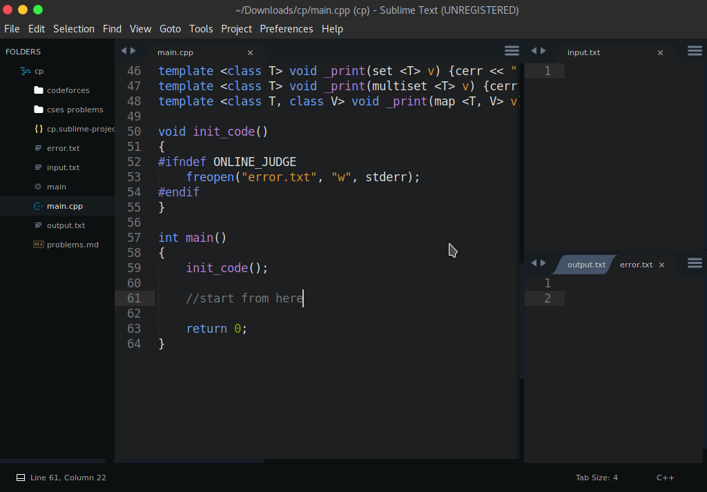
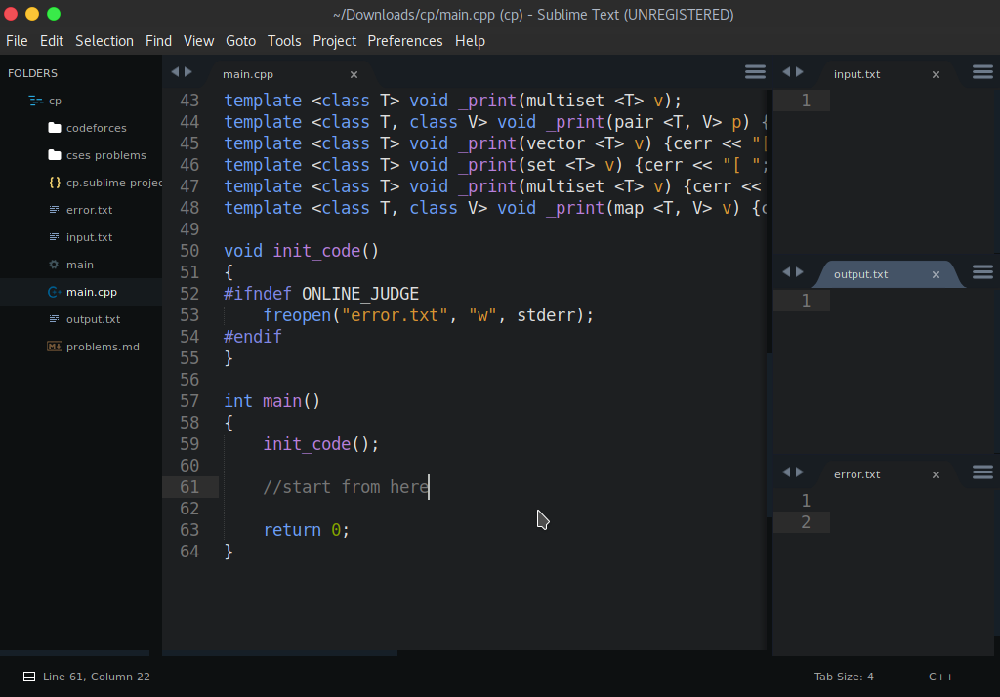
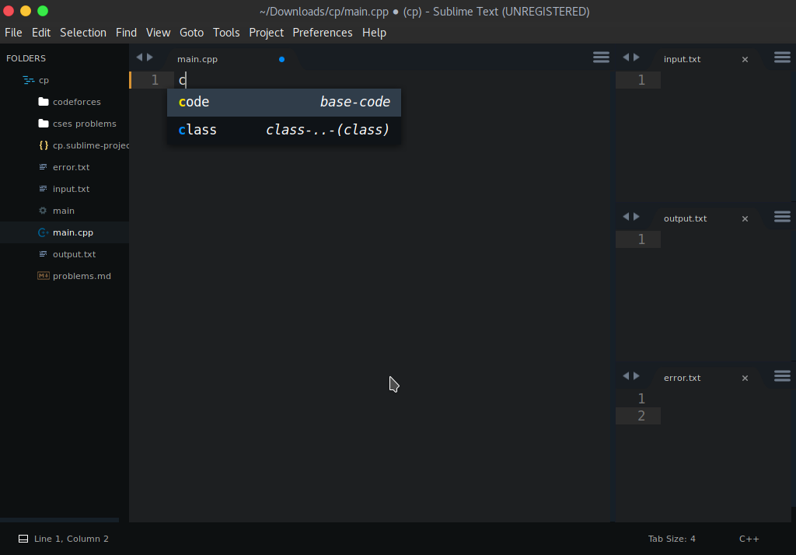

# Sublime 3 setup for competetive programming in Linux

<p align="center">
  <a href="https://github.com/vishal2376/cp-setup/issues">
     
  </a> 
  <a href="https://github.com/vishal2376/cp-setup/stargazers">
     
  </a>
    <a href="https://github.com/vishal2376/cp-setup/blob/master/LICENSE">
     
  </a>
</p>


## Installation :
- Download [Sublime Text](https://www.sublimetext.com/docs/3/linux_repositories.html)
- Install g++ compiler to run c++ files 
- Open Terminal and type 
	```bash
 	sudo apt-get install g++
	```

## Setup Layout :
- You can use either **3 Columns Layout** or **4 Columns Layout** . 
	- For **3 Columns Layout** Press `Shift+Alt+3`
	- For **4 Columns Layout** Press `Shift+Alt+4`
- Click on `View > Groups > Max Columns: 2`
- Now create files `main.cpp` ,`input.txt` ,`output.txt` ,`error.txt` and drag/open in layout windows.




## Build Settings :

- Goto `Tools > Build system > New Build System`
- Copy and paste it in the file
  ```json
  {
  "cmd" : ["g++ -std=c++14 $file_name -o $file_base_name && timeout 4s ./$file_base_name<input.txt>output.txt"], 
  "selector" : "source.cpp",
  "shell": true,
  "working_dir" : "$file_path"
  }
  ```
> **NOTE** : You can change c++ version by using `c++11` or `c++17` instead of `c++14`.

- Now save file as **c++14.sublime-build**
- Goto `tools > build system` and click on **c++14** (same as above file name)  

## Precompile Headers:
- Compile **bits/stdc++.h** header file faster than before.
- Goto the folder location 
  - `/usr/include/i386-linux-gnu/c++/10/bits`  (32-bit)
  - `/usr/include/x64-linux-gnu/c++/10/bits`   (64-bit)
> **NOTE** : version(here 10) may be different in your PC

- Now open **Terminal** with path(folder location) and type the command
  ```bash
  sudo g++ -std=c++14 stdc++.h
  ```
> **NOTE** : Remember C++ version should be same as build settings.  

## Snippets :

- Snippets are used to make coding easier.
- Goto `Preferences > Browse Packages ` and open folder `User`
- Then just copy and paste `base-code.sublime-snippet` file.

### How to use snippets
- Just type **code** and press `TAB`
 

## Bonus :

Sno. | Package Name | Short Description
---|---|---
1 | Sublime AStyle Formatter | Make code beautiful
2 | Easy Clang Complete | Autocomplete code
3 | Side Bar Enhacements | Make sidebar better
4 | Seti | Theme
5 | Bracket Color Scheme | Color Scheme


## Credits :
- Template credit : [Priyansh Agarwal](https://github.com/priyansh19077) 

## More projects : 
   
  - [Virtual Assistant](https://github.com/vishal2376/virtual-assistant)
  - [Website Designs](https://github.com/vishal2376/Website-Design)
  - [Password Generator](https://github.com/vishal2376/password-generator) 
  
## Contact Us:  
  - [Instagram](https://www.instagram.com/vishal_2376/)
  - [Telegram](https://t.me/vishal2376/)
